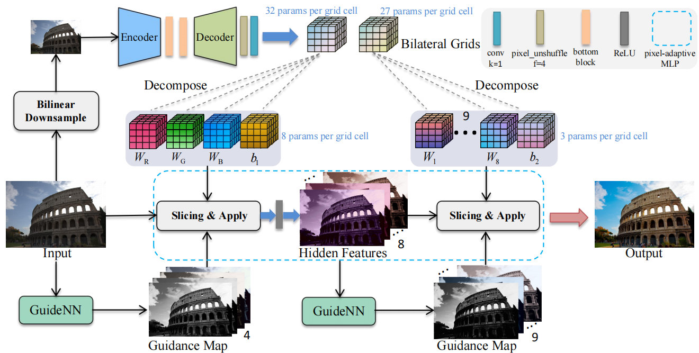

## Learning Pixel-adaptive Multi-layer Perceptrons for Real-time Image Enhancement (ICCV 2025) <br>

[](https://arxiv.org/abs/2507.12135)&nbsp;
[](https://github.com/LabShuHangGU/BPAM)

<p align="center">
  
</p>

This repository is an official implementation of the paper "Learning Pixel-adaptive Multi-layer Perceptrons for Real-time Image Enhancement", ICCV, 2025.

## Preparation

### Dataset
Download  [FiveK (480p)](https://github.com/HuiZeng/Image-Adaptive-3DLUT), [FiveK(4K)](https://github.com/fengzhang427/LLF-LUT), [PPR10K](https://github.com/csjliang/PPR10K), [LCDP](https://www.whyy.site/paper/lcdp) dataset, and place them in your `./datasets`.

### Environment

- Python 3.10
- PyTorch 2.6.0

#### Installation

Download the code:
```
git clone https://github.com/LTH14/mar.git
cd bpam
```

Install the conda environment:

```
conda create -n bpam python=3.10
conda activate bpam
```

Install PyTorch:

```
# CUDA 12.4
pip install torch==2.6.0 torchvision==0.21.0 torchaudio==2.6.0 --index-url https://download.pytorch.org/whl/cu124
```

Install other requirements:

```
pip install -r requirements.txt
```

### Training

- Refer to the training configuration files in `./options/train` folder for detailed settings.

  ```
  CUDA_VISIBLE_DEVICES=0 python train.py -opt options/train/train_tone.yml
  CUDA_VISIBLE_DEVICES=0 python train.py -opt options/train/train_tone_4k.yml
  CUDA_VISIBLE_DEVICES=0 python train.py -opt options/train/train_fivek_pr.yml
  CUDA_VISIBLE_DEVICES=0 python train.py -opt options/train/train_ppr10k.yml
  CUDA_VISIBLE_DEVICES=0 python train.py -opt options/train/train_lcdp.yml
  ```

- ⚡️Though we have controlled the random seed, randomness still exists in training. We believe this may be caused by the function `grid_sample`, please refer to the [note](https://docs.pytorch.org/docs/stable/generated/torch.nn.functional.grid_sample.html). To achieve the results presented in the paper, multiple training attempts may be required.

## Testing

- Refer to the testing configuration files in `./options/test` folder for detailed settings.

  ```
  # Evaluate the results
  CUDA_VISIBLE_DEVICES=0 python test.py -opt options/test/test_tone.yml
  CUDA_VISIBLE_DEVICES=0 python test.py -opt options/test/test_tone_4k.yml
  CUDA_VISIBLE_DEVICES=0 python test.py -opt options/test/test_fivek_pr.yml
  CUDA_VISIBLE_DEVICES=0 python test.py -opt options/test/test_ppr10k.yml
  CUDA_VISIBLE_DEVICES=0 python test.py -opt options/test/test_lcdp.yml
  
  # Evaluate the speed
  CUDA_VISIBLE_DEVICES=0 python test_speed.py -opt options/test/test_speed.yml
  ```

- ### (Optional) CUDA Implementation

  **We also implement the CUDA extension for `MLP` to speed up.**

  ```
  from models.archs.cpp_ext_interface import slice_function,apply_coefficent
  
  cd models/bilateral_slicing
  python setup.py install
  
  cd models/apply_coeff
  python setup.py install
  ```

​	🪐 Replace the function `MLP` in the model with `MLP_CUDA`.

​	🛸 The CUDA version can only be used for inference.

